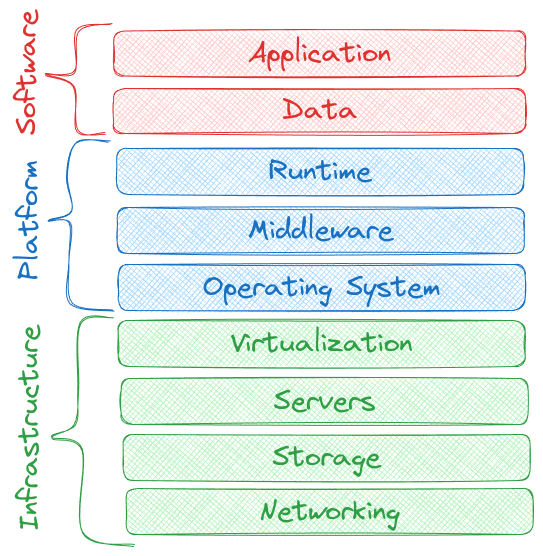

## Service types

1. Function as a Service (FaaS)
2. Software as a Service (SaaS)
3. Platform as a Service (PaaS)
4. Infastructure as a Service (IaaS)

## Basic deployment models

1. Public cloud
2. Private cloud
3. Hybrid cloud
