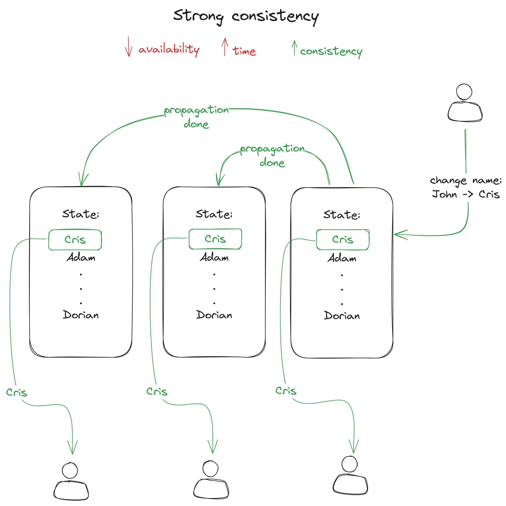
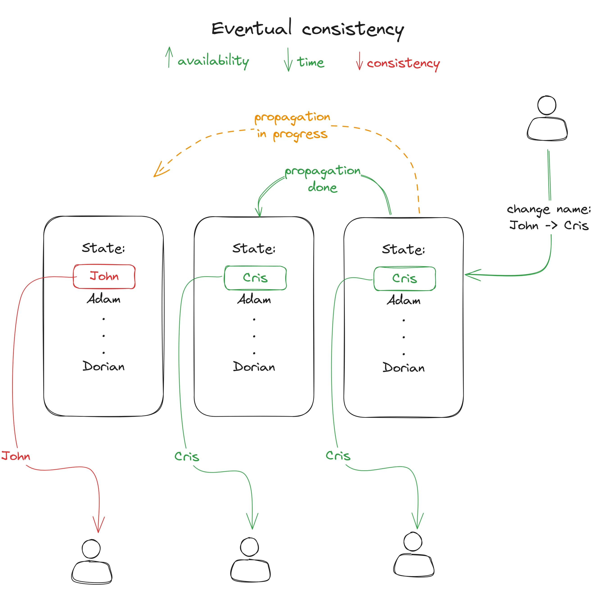

This section is dedicated to system design.

## What is system design?

System design is a process of defining architecture, components, modules, interfaces, and data for a system to satisfy specified requirements. It is a multi-step process that bridges the gap between business requirements and technical implementation.

## Basic concepts

- **Scalability**: Describes the ability of a system to add or remove resources.
- **Consistency**: Read operations always return the latest state of the database.
- **Availability**: Measure of the time a system is operational and available to the users.
- **Reliability**: Ability of a system to perform its intended functions.
- **Agility**: Ability of a system to quickly adapt to changes.
- **Elasticity**: Ability of a system to automatically and dynamically adjust resources based on the demand.
- **Fault Tolerance**: Ability of a system to continue operating in the event of a failure.
- **Disaster Recovery**: Ability of a system to recover from a catastrophic event.

## Scalability

Scalability describes the ability of a system to add or remove resources.

There are two types of scaling strategies:

1. Vertical Scaling
2. Horizontal Scaling

## Consistency

Consistency is the property that ensures that read operations always return the latest state of the database.

## Availability

Availability is a measure of the time a system is operational and available to the users.

| Availability | Downtime per year | Downtime per month | Downtime per week |
| ------------ | ----------------- | ------------------ | ----------------- |
| 90%          | 36.5 days         | 72 hours           | 16.8 hours        |
| 99%          | 3.65 days         | 7.2 hours          | 1.68 hours        |
| 99.9%        | 8.76 hours        | 43.2 minutes       | 10.1 minutes      |
| 99.99%       | 52.6 minutes      | 4.32 minutes       | 1.01 minutes      |
| 99.999%      | 5.26 minutes      | 25.9 seconds       | 6.05 seconds      |

## Reliability

Reliability is the ability of a system to perform its intended functions.

## Agility

Agility is the ability of a system to quickly adapt to changes.

## Elasticity

Elasticity is the ability of a system to automatically and dynamically adjust resources based on the demand.

## Fault Tolerance

Fault tolerance is the ability of a system to continue operating in the event of a failure.

## Disaster Recovery

Disaster recovery is the ability of a system to recover from a catastrophic event.
